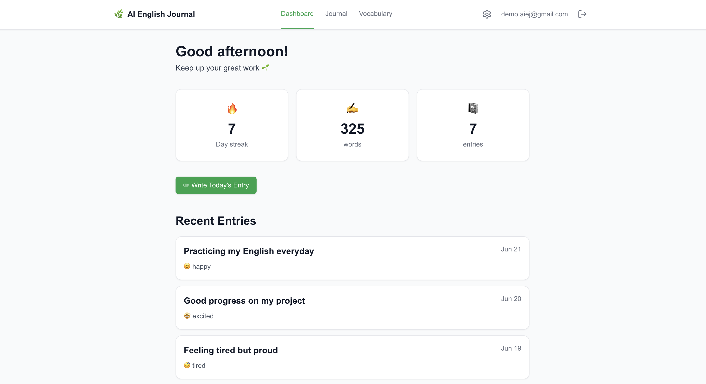
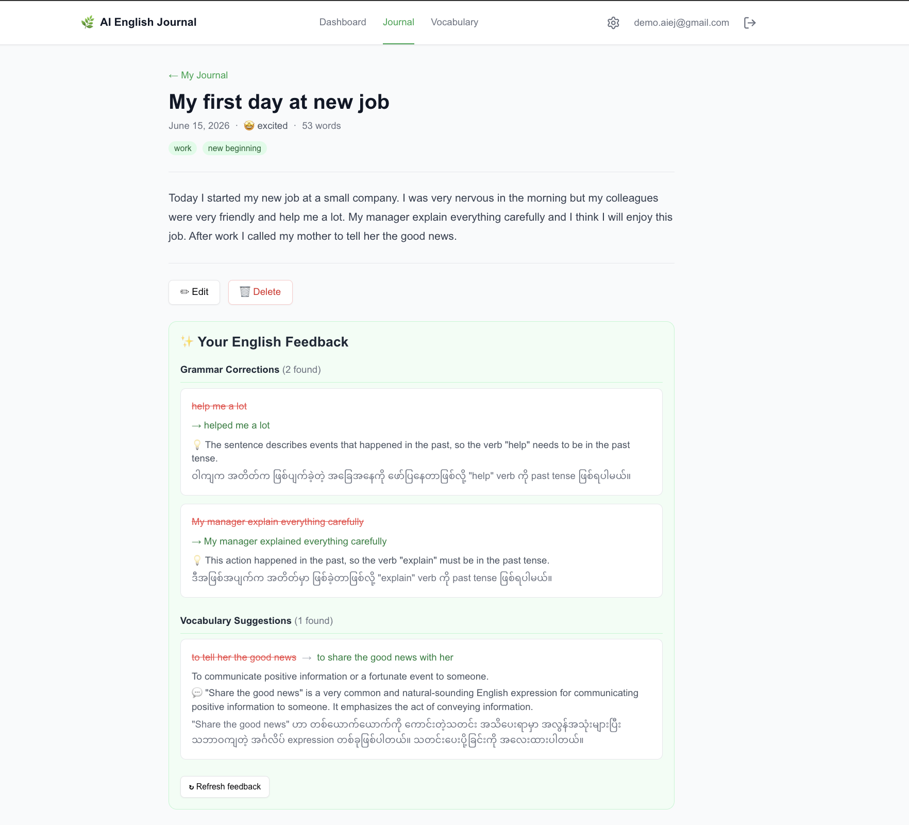
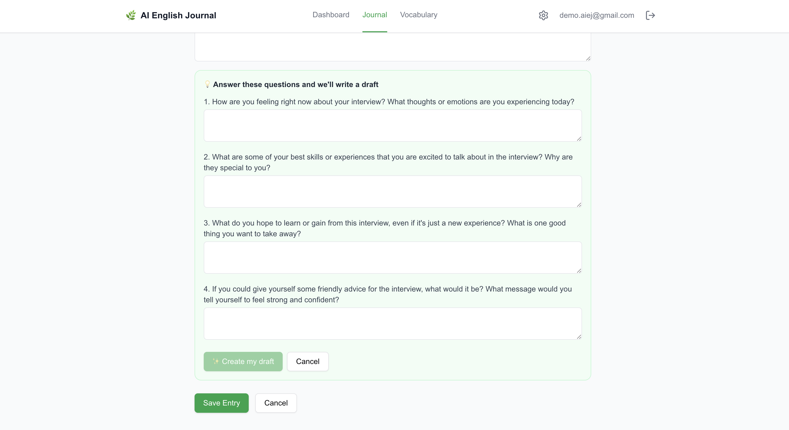
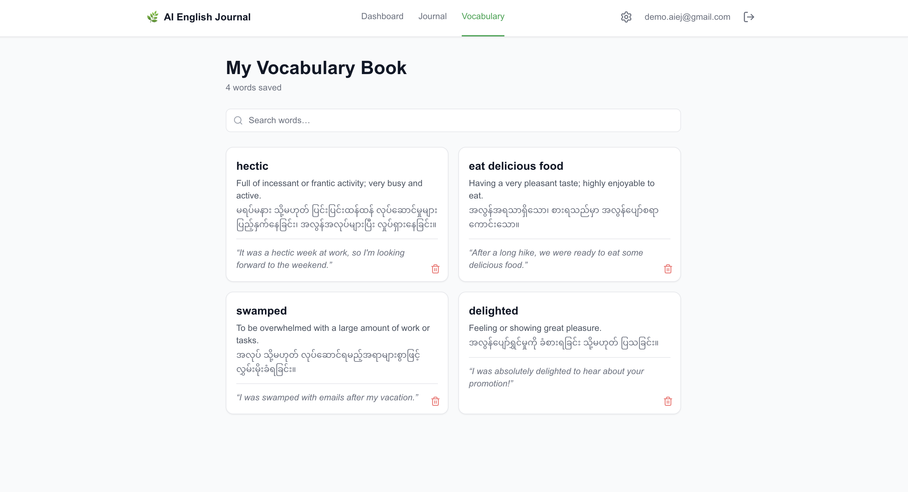
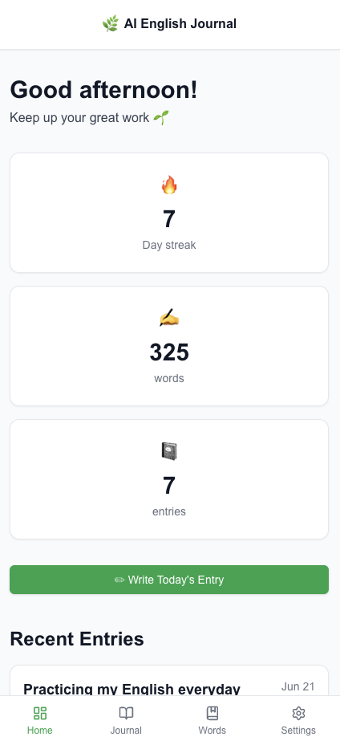

# AI English Journal

A private journaling app that helps Myanmar English learners improve their writing through daily practice, with bilingual AI feedback in English and Myanmar (မြန်မာ).

---

## Live Demo

**Live app:** https://vct-ai-english-journal.vercel.app/

**Demo account** — pre-populated with 7 days of sample entries, a 7-day streak, and saved vocabulary so the dashboard and feature surfaces are non-empty:

- Email: `demo.aiej@gmail.com`
- Password: `12345678`

Please treat the demo account as read/write — feel free to add entries, try the "Check my English" button on the latest entry, save vocabulary, or toggle AI off in Settings to see the disabled state.

---

## Screenshots

|                                                                                        |                                                                                                                                                                                                                                                                            |
| -------------------------------------------------------------------------------------- | -------------------------------------------------------------------------------------------------------------------------------------------------------------------------------------------------------------------------------------------------------------------------- |
|             |                                                                                                                                            |
| **Dashboard** — writing streak, total words, recent entries                            | **Bilingual AI feedback** — the standout differentiator. Each grammar correction is explained in English first (the target language), then translated to Myanmar directly beneath so the learner can verify their understanding without context-switching to a translator. |
|  |                                                                                                                                                                              |
| **Journal entry** — full body, mood badge, tags, and the "Check my English" trigger    | **Vocabulary book** — words the learner saved from AI suggestions, each with bilingual definition                                                                                                                                                                          |
|         |                                                                                                                                                                                                                                                                            |
| **Mobile** — bottom nav, full-viewport writing experience, responsive throughout       |                                                                                                                                                                                                                                                                            |

---

## Key Features

- **Bilingual AI English teacher** — Grammar corrections and vocabulary suggestions arrive as paired English + Myanmar explanations. The English line is primary (users are here to learn English); the Myanmar line sits directly beneath as a comprehension safety net for learners still building fluency. When Myanmar text is absent for older feedback, the UI gracefully omits the line rather than showing "translation unavailable" placeholders.
- **Grammar correction with simple explanations** — Powered by Google Gemini (`gemini-2.5-flash`). The prompt instructs the model to explain _why_ a correction was made in simple terms — not just mark errors red.
- **Guided journaling** — When a user doesn't know what to write, the AI generates 3–5 open-ended questions tailored to an optional topic hint. Their answers become the basis for an AI-drafted entry the user then edits and saves.
- **Vocabulary building** — Save words surfaced during AI feedback directly from the suggestion card. Each saved word stores the bilingual definition and an example sentence for later review.
- **Streak tracking** — Current streak, longest streak, total words, and total entries, updated transactionally when an entry is saved.
- **Privacy controls** — All entries are private by default. AI features can be toggled off per user; every AI endpoint checks the `ai_enabled` flag before any external API call, so a user who turns AI off pays no Gemini cost and shares no entry text with a third-party model.

---

## Tech Stack

| Layer              | Technology                                                                    |
| ------------------ | ----------------------------------------------------------------------------- |
| Frontend framework | Next.js 14 (App Router)                                                       |
| Language           | TypeScript                                                                    |
| Styling            | Tailwind CSS v3                                                               |
| UI components      | shadcn/ui (style: `new-york`, base color: `zinc`, with brand-green overrides) |
| Backend            | Next.js API Routes                                                            |
| Database           | PostgreSQL via Supabase                                                       |
| Authentication     | Supabase Auth (email + password)                                              |
| AI                 | Google Gemini API (`gemini-2.5-flash`)                                        |
| Hosting            | Vercel                                                                        |

---

## What I Learned

**Spec-driven development with AI coding agents.** This project was built collaboratively with an AI coding agent following hand-written specifications under `docs/` (`PROJECT_SPEC.md`, `API_SPEC.md`, `DATABASE_SPEC.md`, `UI_SPEC.md`). Writing the specs _first_ — including non-negotiable rules like "session verification is the first thing every API route does" and "every DB query scopes to the authenticated user" — turned out to be the single biggest leverage point. When the agent occasionally drifted toward shortcuts, the spec was the source of truth I could point to. The trade-off: spec maintenance is real work in its own right, and stale specs lie. I kept `specs/CHANGELOG.md` next to the code to record decisions and known gaps so the spec drift didn't compound silently.

**Debugging real production-shaped issues, honestly named.** Two examples worth calling out concretely:

1. _Infinite redirect loop between middleware and dashboard._ A transient network blip to Supabase caused the page-level `getUser()` to fail while middleware still considered the user authenticated — and a redundant page-level `redirect("/login")` then bounced the user back and forth until React threw "Maximum update depth exceeded." The fix was structural: middleware became the single source of truth for route protection, the dashboard switched from `getUser()` (network) to `getSession()` (local JWT decode), and `middleware.ts` was fixed to preserve refreshed cookies on redirect responses (it had been dropping them by returning a bare `NextResponse.redirect()`). Lesson: only one layer should make security decisions, and downstream layers should trust that decision rather than re-verify over the network.

2. _RLS policy gap silently zeroing writes._ The `writing_streaks` table had RLS enabled with a `SELECT` policy but no `UPDATE` policy. The streak update in `POST /api/entries` ran under the user's session via the anon-key server client, so RLS applied — and silently affected zero rows. No error, no warning, just dashboards that never incremented. Fixed by adding an explicit `UPDATE` policy `USING (auth.uid() = user_id) WITH CHECK (auth.uid() = user_id)`. RLS failing closed is the _right_ default; the bug was forgetting that "select works" doesn't imply "update works."

**Navigating real-world constraints — Gemini's regional restriction.** Gemini was unreachable from the developer's region (Myanmar) for the entire build of Phases 5–7. Rather than block, I built the three `/api/ai/*` routes against a hand-written `MOCK_AI_RESPONSES` env flag that returned deterministic fixture JSON matching the real response shape. Every defensive parse, every edge case (model returns markdown fences, model omits the Myanmar field, model returns empty arrays) was implementable and testable locally without the live API. The mock branches were physically deleted as part of pre-deployment cleanup — not left disabled behind an env flag — so a future misconfiguration couldn't accidentally serve fixture data to real users. The subsequent Vercel deployment was the verification step: real Gemini responded correctly from US-East on the first request, with no fallback path needed because none existed any more.

---

## Architecture Highlights

- **Row Level Security for defense in depth.** Every table (`profiles`, `journal_entries`, `ai_feedback`, `saved_words`, `writing_streaks`) has RLS enabled with `SELECT`/`INSERT`/`UPDATE`/`DELETE` policies scoped to `auth.uid() = user_id`. Application-layer queries already scope by user, but RLS is the second wall — a query without a `WHERE user_id` filter still returns zero rows of other users' data instead of leaking it.
- **`requireUser()` helper across 9 API routes.** A small wrapper in `lib/supabase/auth-guard.ts` distinguishes "no JWT" (`AuthSessionMissingError` → HTTP 401) from "Supabase Auth endpoint is unreachable" (`AuthRetryableFetchError` → HTTP 503). Before this split, a regional/network outage to the Auth endpoint looked identical to a missing session in DevTools, which had me chasing auth bugs that didn't exist. Same helper now used by `/api/entries/*`, `/api/ai/*`, `/api/vocabulary/*`, `/api/settings`, and `/api/entries/search` — one place to fix, one shape for both real auth failures and infra outages.
- **Defensive AI response parsing.** Gemini's JSON output is occasionally wrapped in markdown code fences, prefixed with conversational preamble ("Here's your draft:"), or missing fields the prompt asked for. `lib/gemini/parse-utils.ts` strips fences and extracts the first JSON object; each route then filters the parsed result by checking every field is a non-empty string of the expected type before persisting. A malformed LLM response surfaces to the user as "AI service unavailable. Please try again later." (HTTP 502) rather than corrupting the database.
- **Bilingual data as an additive JSONB change.** Adding Myanmar translations (`explanation_my`, `reason_my`, `definition_my`) required no schema migration — they live inside the existing `corrections` / `suggestions` JSONB arrays and a nullable `definition_my` column on `saved_words`. Older rows simply omit the fields; the UI renders English-only when the Myanmar field is missing rather than rendering a placeholder.

---

## Local Development Setup

### Prerequisites

- Node.js 20+
- A free Supabase project ([supabase.com](https://supabase.com))
- A Google AI Studio API key for Gemini ([aistudio.google.com](https://aistudio.google.com))

### Setup

```bash
git clone https://github.com/HtetLin27/ai-english-journal.git
cd ai-english-journal
npm install
```

Create `.env.local` in the project root:

```env
NEXT_PUBLIC_SUPABASE_URL=
NEXT_PUBLIC_SUPABASE_ANON_KEY=
SUPABASE_SERVICE_ROLE_KEY=
GEMINI_API_KEY=
```

Initialize the Supabase schema: open your Supabase project's **SQL Editor**, paste the full script from `docs/DATABASE_SPEC.md` §10 (Full Execution Script), and run it once. This creates all tables, indexes, RLS policies, the `set_updated_at` utility, and the `on_auth_user_created` trigger that auto-provisions `profiles` and `writing_streaks` rows on signup.

Run the dev server:

```bash
npm run dev
```

Open [http://localhost:3000](http://localhost:3000), sign up, and you're in.

> **Note on Gemini access:** if Gemini is not reachable from your region, the three `/api/ai/*` routes will return HTTP 502 locally. The app still works for journaling, search, vocabulary, and streaks — only AI feedback is affected. Deploy to Vercel (US-East default) to verify the AI flow end-to-end.

---

## Project Structure

```
app/
  (auth)/              Login, signup — full-screen centered layout
  (app)/               Protected pages with top + bottom nav
    dashboard/         Stats and recent entries
    journal/           List, new entry, view, edit
    vocabulary/        Saved words
    settings/          AI toggle + logout
  api/                 Next.js API Routes (auth, entries, ai, vocabulary, stats, settings)
components/
  ai/                  AiFeedbackPanel, CorrectionCard, SuggestionCard, GuidedQuestions
  journal/             EntryForm, JournalCard, MoodSelector, TagInput, SearchBar, FilterBar
  vocabulary/          WordCard
  dashboard/           StatsCard
  shared/              Navbar, LogoutButton
  ui/                  shadcn/ui primitives (Button, Card, Input, Select, Switch, etc.)
lib/
  supabase/            Browser + server clients, requireUser() auth guard
  gemini/              Gemini client + JSON-from-LLM parsing utilities
  utils/               API response envelope helper
docs/                  Specifications (PROJECT, API, DATABASE, UI)
specs/                 Working notes — CHANGELOG, REGRESSION_CHECKLIST, DEPLOYMENT_CHECKLIST
```

The specs under `docs/` are the contract; the working notes under `specs/` are what kept the project honest during build.
